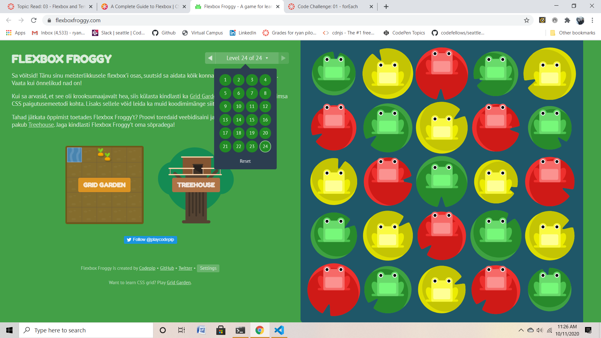

## Mustache

- Javascript templating is a fast and efficient technique to render client-side view templates with Javascript by using a JSON data source. The template is HTML markup, with added templating tags that will either insert variables or run programming logic.

- Mustache is a logic-less template syntax. It can be used for HTML, config files, source code — anything. It works by expanding tags in a template using values provided in a hash or object.

- If you intend you use mustache with Node and Express, you can use mustache-express. Mustache Express lets you use Mustache and Express together easily.
To install:
With Yarn:

`$ yarn add mustache-express`

or with NPM:

`$ npm install mustache --save`

## Flex Box

1. Display; This defines a flex container; inline or block depending on the given value. It enables a flex context for all its direct children.
    - row (default): left to right in ltr; right to left in rtl
    - row-reverse: right to left in ltr; left to right in rtl
    - column: same as row but top to bottom
    - column-reverse: same as row-reverse but bottom to top

2.  Flex-wrap; By default, flex items will all try to fit onto one line. You can change that and allow the items to wrap as needed with this property.
    - nowrap (default): all flex items will be on one line
    - wrap: flex items will wrap onto multiple lines, from top to bottom.
    - wrap-reverse: flex items will wrap onto multiple lines from bottom to top.

3. Flex-flow; This is a shorthand for the flex-direction and flex-wrap properties, which together define the flex container’s main and cross axes. The default value is row nowrap.

4. Justify-content; This defines the alignment along the main axis. It helps distribute extra free space leftover when either all the flex items on a line are inflexible, or are flexible but have reached their maximum size. It also exerts some control over the alignment of items when they overflow the line.
    - flex-start (default): items are packed toward the start of the flex-direction.
    - flex-end: items are packed toward the end of the flex-direction.
    - start: items are packed toward the start of the writing-mode direction.
    - end: items are packed toward the end of the writing-mode direction.
    - left: items are packed toward left edge of the container, unless that doesn’t make sense with the flex-direction, then it behaves like start.
    - right: items are packed toward right edge of the container, unless that doesn’t make sense with the flex-direction, then it behaves like start.
    - center: items are centered along the line
    - space-between: items are evenly distributed in the line; first item is on the start line, last item on the end line
    - space-around: items are evenly distributed in the line with equal space around them. Note that visually the spaces aren’t equal, since all   the items have equal space on both sides. The first item will have one unit of space against the container edge, but two units of space between the next item because that next item has its own spacing that applies.
    - space-evenly: items are distributed so that the spacing between any two items (and the space to the edges) is equal.

5. Align-items; This defines the default behavior for how flex items are laid out along the cross axis on the current line. Think of it as the justify-content version for the cross-axis (perpendicular to the main-axis).
    - stretch (default): stretch to fill the container (still respect min-width/max-width)
    - flex-start / start / self-start: items are placed at the start of the cross axis. The difference between these is subtle, and is about respecting the flex-direction rules or the writing-mode rules.
    - flex-end / end / self-end: items are placed at the end of the cross axis. The difference again is subtle and is about respecting flex-direction rules vs. writing-mode rules.
    - center: items are centered in the cross-axis
    - baseline: items are aligned such as their baselines align

6. Align-content; This aligns a flex container’s lines within when there is extra space in the cross-axis, similar to how justify-content aligns individual items within the main-axis.
    - normal (default): items are packed in their default position as if no value was set.
    - flex-start / start: items packed to the start of the container. The (more supported) flex-start honors the flex-direction while start honors the writing-mode direction.
    - flex-end / end: items packed to the end of the container. The (more support) flex-end honors the flex-direction while end honors the writing-mode direction.
    - center: items centered in the container
    - space-between: items evenly distributed; the first line is at the start of the container while the last one is at the end
    - space-around: items evenly distributed with equal space around each line
    - space-evenly: items are evenly distributed with equal space around them
    - stretch: lines stretch to take up the remaining space

## Flex Frog

