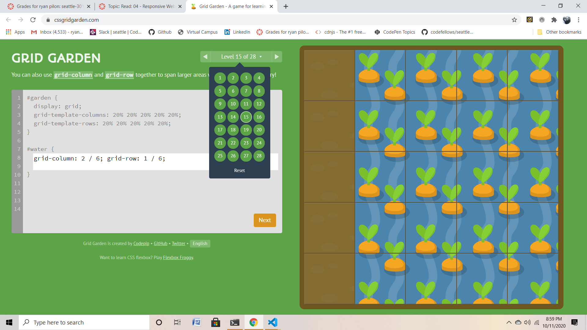

## Grid Garden

## Grid
1. Display; Defines the element as a grid container and establishes a new grid formatting context for its contents.
    - grid – generates a block-level grid
    - inline-grid – generates an inline-level grid

2. Grid-template-columns; Defines the columns and rows of the grid with a space-separated list of values. The values represent the track size, and the space between them represents the grid line.
    - <track-size> – can be a length, a percentage, or a fraction of the free space in the grid (using the fr unit)
    - <line-name> – an arbitrary name of your choosing

3. Grid-template-areas; Defines a grid template by referencing the names of the grid areas which are specified with the grid-area property. Repeating the name of a grid area causes the content to span those cells. A period signifies an empty cell. The syntax itself provides a visualization of the structure of the grid.
    - <grid-area-name> – the name of a grid area specified with grid-area
    - . – a period signifies an empty grid cell
    - none – no grid areas are defined

4. Align-items; Aligns grid items along the block (column) axis (as opposed to justify-items which aligns along the inline (row) axis). This value applies to all grid items inside the container.
    - start – aligns items to be flush with the start edge of their cell
    - end – aligns items to be flush with the end edge of their cell
    - center – aligns items in the center of their cell
    - stretch – fills the whole height of the cell (this is the default)

5. Justify-content; Sometimes the total size of your grid might be less than the size of its grid container. This could happen if all of your grid items are sized with non-flexible units like px. In this case you can set the alignment of the grid within the grid container. This property aligns the grid along the inline (row) axis (as opposed to align-content which aligns the grid along the block (column) axis).
    - start – aligns the grid to be flush with the start edge of the grid container
    - end – aligns the grid to be flush with the end edge of the grid container
    - center – aligns the grid in the center of the grid container
    - stretch – resizes the grid items to allow the grid to fill the full width of the grid container
    - space-around – places an even amount of space between each grid item, with half-sized spaces on the far ends
    - space-between – places an even amount of space between each grid item, with no space at the far ends
    - space-evenly – places an even amount of space between each grid item, including the far ends

     [<===BACK](README.MD)